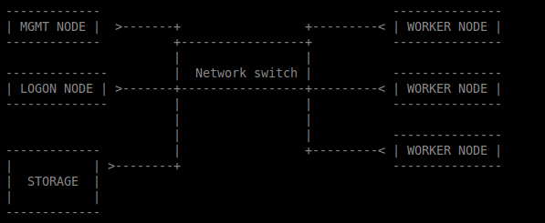

==========================
High Performance Computing
==========================

Fast Start
==========

Tutorials are boring if they don't start straight away. How do you use HPC?

1. Write a shell (bash, sh, tcsh, csh or ksh) script
2. Send it to the job queueing system.

Obviously there is more to it than that, so let's start with the minimal 
extras: what to put into the script and how to put something in the queue.

The Script
----------

I called it a shell script above because that's what it is. But in HPC 
terminology it can also be called a PBS script. PBS is the job scheduling 
system used on this cluster.

.. code:: shell
    
    #!/bin/bash     
    # pbs script to calculate The Trapezoidal Rule
    # https://en.wikipedia.org/wiki/Trapezoidal_rule
    #PBS -N Job_Name  
    # PBS -A ProjectID
    #PBS -q QueueName
    #PBS -m ae   
    #PBS -l nodes=1:ppn=6
    #PBS -l walltime=01:00:00 
    #PBS -l pmem=2000mb   
    module load python
    cd $PBS_O_WORKDIR 
    echo $HOSTNAME
    python helloworld.py   
    #mpiexec -n 4 python trapParallel_2.py 0.0 1.0 10000

1. #!/bin/bash

Like most scripts, if you leave this out, it will default to /bin/sh

2. #PBS vs # PBS

Using the hash (#) is the normal way to comment in a script. Within the PBS 
environment

#PBS will run the PBS command, # PBS will not. IE, the second incarnation # PBS 
is considered "commented out". In the code listed, you will see that the 
ProjectID line is commented out.

There are a number of default positions, the only strictly necessary PBS
directive is the -N JobName.

3. #PBS -q QueueName

Queues are used to help prioritise jobs. There are a number of queues that can 
be used on the cluster, choosing the appropriate queue will help get your 
program running as expected.

The available queues are serial (default), fast, parallel and batch. Each has 
different profile: min/max of nodes & cores, etc. The full list is 
`here <https://edward-web.hpc.unimelb.edu.au/doku.php?id=guides#creating_a_pbs_script>`_.

4. #PBS -m ae

Mail the user if the job aborts or ends.

5. #PBS -l nodes=1:ppn=6

Here we are requesting a single node and 6 cores within that node.

6. #PBS -l walltime=01:00:00 

Walltime specifies how long the job will run for. Data loss can ensue, be 
careful. Administrators can extend the wall time if required, although 
only up to a maximum of 96 days. 

7. #PBS -l pmem=2000mb

Requesting a particular amount of memory.

8. module load python

Modules do a lot of dynamic system configuration for us and allow different 
versions of the same software to be installed and used. We will talk more 
about modules a little later.

9.  

HPC Structure - the Hardware
============================

What does a High Performance Computer look like, and why do I need to know?

There is no need for users to have a comprehensive understanding of the HPC 
hardware, but there is a need for users to have some idea of what it looks 
like - how it is made up.

HPC is normal computing, writ large. There is more RAM ("memory"), more CPU, 
more HD, more network bandwidth.

As such, we are more thoughtful about how we use those resources.

The Storage is the hard drive space - we don't need to worry too much about it, 
just know it exists.

The network switch is how all of these parts communicate, and is again 
relatively neutral, although we will address latency (speed of data across the 
network) when thinking about how to set up our projects.

THIS IS THE IMPORTANT STUFF:

The LOGON NODE looks after all of your authentication credentials, including 
the creation of your "home" space: /home/<username>. This home space is 
generic and shared across the cluster.

The Management (MGMT) Node does all the traffic control, manages the worker 
nodes and, most importantly, runs the program you would like to run.

This is an important distinction. The LOGON NODE is where you end up when 
you have logged in. It is important to remember to switch to the MGMT NODE when
running your programs so the LOGON NODE isn't rendered unusable by your large 
project. It has been specifically built for a single reason - to manage users 
and logins. The MGMT NODE is designed to run projects and farm out the work to 
the worker nodes.

Accidentally run your project on the LOGON NODE and you will have a bad 
experience: other people will have degraded experiences (probably wont be able
to do anything), your project will not run on the full power of the HPC, and
an admin will most likely kill it.

Each WORKER NODE has 16 cores and 64 GB of memory. The MGMT NODE will distibute
your project across the cores and nodes as necessary.

The current system has 180 WORKER NODES for 2880 cores total.

Working notes:
It's important for users to understand how HPC is constructed physically because:

 - there are performance reasons (it *is* HPC after all, this is no butter knife, it's a chainsaw.)
 - there is the practical *result* reason - an understanding of how to get the *best* result from HPC. If your project gets no positive value, why use HPC in the first place?
 - there is the practical working reason - without an understanding you may break it.

---------------------------------------------------------------- 

HPC Structure - the efficiencies 
================================

The first and most obvious efficiency is that the cluster can do parallel 
computing. With that many nodes and cores, a lot of software can perform with
better throughput.

This is the difference between a four core laptop taking a month to run a
complex function in MatLab and the cluster running in in tens of minutes 
utilising numerous cores - as many as you request.

working notes
 - gives us an understanding of approximately what type of efficiencies we 
   can expect, and from this we can determine how many cores/cpus to 
   request

HPC Structure - the limits
==========================

If you request more than 128 cores, you may be waiting a long time for 
those cores to be free. 

Working notes:

 - gives us an understanding of scheduling/job queueing and how it is done
 - nodes vs cores, why it matters, and when it doesn't 

   
