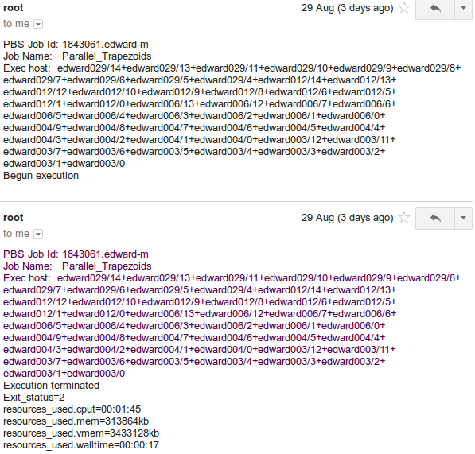

==========================
High Performance Computing
==========================

Fast Start
==========

Tutorials are boring if they don't start straight away. How do you use HPC?

1. Write a shell (bash, sh, tcsh, csh or ksh) script that manages your program
2. Send it to the job queueing system.

Obviously there is more to it than that, so let's start with the minimal 
extras: what to put into the script and how to put something in the queue.

Quick and dirty start:

 - login to Edward
 - cd /data/project1/pMelb0283/
 - cp -r trapezoids <username>
 - cd <username>
 - vim myTrapParallel.pbs 

----------
The Script
----------

I called it a shell script above because that's what it is. But in HPC 
terminology it can also be called a PBS script. PBS - Portable Batch System -
is the job scheduling system used on this cluster.

Below is an example script that we will work through line by line to get an
understanding of similarities and differences between shell and PBS scripts.

.. code:: shell
    
    #!/bin/bash     
    # pbs script to calculate The Trapezoidal Rule
    # https://en.wikipedia.org/wiki/Trapezoidal_rule
    #PBS -N Job_Name  
    # PBS -A ProjectID
    #PBS -q QueueName
    #PBS -m bae
    #PBS -l nodes=1:ppn=6
    #PBS -l walltime=01:00:00 
    #PBS -l pmem=2000mb   
    module load python
    cd $PBS_O_WORKDIR 
    echo $HOSTNAME
    mpiexec python trapParallel_1.py 0.0 1.0 10000

**1. #!/bin/bash**

Like most scripts, if you leave this out, it will default to /bin/sh.

(Pedant: ok, ok, it depends on the system default which is not always /bin/sh,
but let's move on)

**2. #PBS vs # PBS**

Using the hash (#) is the traditional way to comment in a script. Within the 
PBS environment

#PBS will run the PBS command 
# PBS will not. 

IE, the second incarnation # PBS is considered "commented out". In the code 
above, you will see that the ProjectID line is commented out.

There are a number of default values, the only strictly necessary PBS
directive is the -N JobName.

Important note - # is still used as the character to comment out non-PBS script
lines.

**3. #PBS -q QueueName**

Queues are used to help prioritise jobs. There are a number of queues that can 
be used on the cluster, choosing the appropriate queue will help get your 
program running as expected.

The available queues are serial (default), fast, parallel and batch. Each has 
different profile: min/max of nodes & cores, memory - and, of course, the time
you wil need to wait to get those resources. The full list is 
`here <https://edward-web.hpc.unimelb.edu.au/doku.php?id=guides#creating_a_pbs_script>`_.

**4. #PBS -m ae**

Mail the user if the job begins, aborts or ends. Note that the email will also tell
you which nodes and cores were used if it completed successfully:

**5. #PBS -l nodes=1:ppn=6**

Here we are requesting a single node and 6 cores within that node. Note that 
in image above, I have asked for 50 cores. That would look like:

.. code:: shell

    #PBS -l nodes=5:ppn=10

**6. #PBS -l walltime=01:00:00**

Walltime specifies the maximum time the job should be run for. Essentially
tells the system "kill this process once it has run for <walltime> long".
The default is an hour. 

Everyone makes coding errors - this is one way the system protects the 
community of users against scripts-gone-wild.

Of course, when a process is nuked mid execution, data loss can ensue, so be 
careful. Administrators can extend the wall time if required, although only 
up to a maximum of 96 days. (!)

**7. #PBS -l pmem=2000mb**

Requesting a particular amount of memory. This is a "per core" memory request.
Each node has 64GB of memory. 

**8. module load python**

Modules do a lot of dynamic system configuration for us and allow different 
versions of the same software to be installed and used. We will talk more 
about modules a little later.

**9.  cd $PBS_O_WORKDIR**
    
This is more important than is immediately obvious, because of the nature of the HPC set up.

- PBS **always** starts executing a job in the user's home directory. 
- $PBS_O_WORKDIR refers to the directory from which the script was put into the
  job queue. (we will see how this is done in a moment)
- important to note that there are three factors here:

 - user's home dir: /home/<username>/
 - location of script, for example: 
   /data/project1/pMelb0283/trapezoids/myTrapParallel.pbs
 - location from which script is queued: anywhere you want, with sensible
   defaults preferred.

**10. echo $HOSTNAME**

Execute a command into the output (just as an eg that this is a regular bash
script.

**11. mpiexec python trapParallel_1.py 0.0 1.0 10000**

How we execute our trapParallel_1.py command. Note that not every module or
program needs to be run using mpiexec - in this case our python script is
specially crafted to take advantage of the multiple cores (beyond the scope
of this tutorial).

---------
The Queue
---------

To run a script against all those cores, we need to put the "job" in a queue.
Depending on how many nodes and cores we need, there are different queues. We
saw these represented at step 3 above.

But how do we get it into that queue? We use the command qsub:

.. code:: shell

    [user@edward user]$ qsub myTrapParallel.pbs 
    1843343.edward-m
    [user@edward user]$ 

Here we have used qsub to submit the job to a queue, and edward has responded 
with a job number.

We can see the state of the queue using qstat:

.. code:: shell
    
    [user@edward user]$ qstat 

That output isn't much use to us - let's reduce it to just our part of the queue:

.. code:: shell
    
    [user@edward user]$ qstat -u user

    edward-m: 
                                                                             Req'd  Req'd   Elap
    Job ID               Username    Queue    Jobname          SessID NDS   TSK    Memory Time  S Time
    -------------------- ----------- -------- ---------------- ------ ----- ------ ------ ----- - -----
    1843061.edward-m     user        parallel parallel_trapezo    --      5     50    --  01:00 Q   -- 
    1843230.edward-m     user        fast     parallel_trapezo    --      1     10    --  01:00 Q   -- 
    1843343.edward-m     user        fast     parallel_trapezo    --      1     10    --  01:00 Q   -- 

PBS_O_WORKDIR
-------------

In step 9 above we referred to the $PBS_O_WORKDIR directory. 

When I queued the job above, I did it from my (well, user's) home directory.
This is frowned upon, especially for anything that uses or creates large data
sets. In fact, with a sufficiently large data set, you might fill the disks
that the home directories are on, which kills the system.

This is why we have the project directory structure:

/data/project1/

in which we have a project, this project is at:

/data/project1/pMelb0283/

in which we can put anything we want - like personal directories.

/data/project1/pMelb0283/trapezoids/myTrapParallel.pbs

So. Looking back on step 9, we would ideally run our script from within our 
project:

.. code:: shell

    user@edward ~]$ pwd
    /home/user
    [user@edward ~]$ cd /data/project1/pMelb0283/trapezoids
    [user@edward trapezoids]$ qsub myTrapParallel.pbs 
    1847893.edward-m
    [user@edward trapezoids]$ 

Of course, we could just as easily run it from anywhere:

.. code:: shell

    [user@edward trapezoids]$ pwd
    /data/project1/pMelb0283/trapezoids
    [user@edward trapezoids]$ cd /tmp/
    [user@edward tmp]$ qsub /data/project1/pMelb0283/trapezoids/myTrapParallel.pbs 
    1848116.edward-m
    [user@edward tmp]$ 

In this case, $PBS_O_WORKDIR would be /tmp - again, less than ideal. Remember 
to include the cd into $PBS_O_WORKDIR and remember to launch from your project 
directory and you will remain friends with the systems administrator.

-------
Modules
-------

In step 8 we mentioned modules. There are a number of modules and module 
commands available to us. 

Why modules? Modules allow for multiple versions of the same software to be run
on the HPC. I want python 2.7, you want python 3.4. I need 32 bit Java, you 
need 64 bit Java. Like Python's virtualenvs, the HPC is set up to isolate what
you need for any particular project.

When you login, none of these are natively available to you. When you load a 
module, the system loads all the configurations that will be required - adding
PATHs, location of software etc.

Each new session will have only the defaults loaded. Start a screen session
within a session and all will have any modules you have loaded. Secure shell
in from another terminal and you will only have the defaults.

So, to take our script as an example, and because it has a healthy fork atm, 
let's look at Python. At first we get what we would expect in any unix like
system.

Them with tab completion*, we can see the options module can take. (\*type 
module, then hit tab a couple of times*.)

.. code:: shell

    [user@edward ~]$ which python
    /usr/bin/python
    [user@edward ~]$ python --version
    Python 2.6.6
    [user@edward ~]$ python3
    -bash: python3: command not found
    [user@edward ~]$ module 
    add          help         initrm       purge        switch       whatis
    apropos      initadd      initswitch   refresh      unload       
    avail        initclear    keyword      rm           unuse        
    clear        initlist     list         show         update       
    display      initprepend  load         swap         use          

Module has a man page to see what each of those commands does. Ok, let's use 
module list to see what we have intalled already (ie, by default). 

.. code:: shell

    [user@edward ~]$ module list 
    Currently Loaded Modulefiles:
      1) modules                4) mpc/0.9                7) openmpi-gcc/1.4.5
      2) gmp/5.0.2              5) gcc/4.6.2              8) edward/config-201201
      3) mpfr/3.1.0             6) intel/2012.0

Unfortunately the output from 'module avail' can't be grepped, but we can 
filter using partials.

.. code:: shell

    [user@edward ~]$ module load python
    python             python/2.7.2-gcc   python/2.7.6-gcc   python/3.2.3-gcc
    python/2.7.10-gcc  python/2.7.3-gcc   python/3.2.2-gcc   
    [user@edward ~]$ module load python/3.2.3-gcc 
    [user@edward ~]$ module list
    Currently Loaded Modulefiles:
      1) modules                5) gcc/4.6.2              9) zlib/1.2.7
      2) gmp/5.0.2              6) intel/2012.0          10) python/3.2.3-gcc
      3) mpfr/3.1.0             7) openmpi-gcc/1.4.5
      4) mpc/0.9                8) edward/config-201201

Note that zlib is also loaded now - module has looked after that for us.

.. code:: shell

    [user@edward ~]$ which python
    /usr/bin/python
    [user@edward ~]$ which python3
    /usr/local/python/3.2.3-gcc/bin/python3

And of course, Python plays funny - because the software is itself struggling
with the fork, \*nix systems are coming with python and python3.

Try module rm py(tab) zli(tab) and then python3.

Finally, we will look at the 

HPC Structure - the Hardware
============================

What does a High Performance Computer look like, and why do I need to know?

There is no need for users to have a comprehensive understanding of the HPC 
hardware, but there is a need for users to have some idea of what it looks 
like - how it is made up.

HPC is normal computing, writ large. There is more RAM ("memory"), more CPU, 
more HD, more network bandwidth.

As such, we are more thoughtful about how we use those resources.

.. image:: imgs/hpc_structure.png

The Storage is the hard drive space - we don't need to worry too much about it, 
just know it exists.

The network switch is how all of these parts communicate, and is again 
relatively neutral, although we will address latency (speed of data across the 
network) when thinking about how to set up our projects.

THIS IS THE IMPORTANT STUFF:

The LOGON NODE looks after all of your authentication credentials, including 
the creation of your "home" space: /home/<username>. This home space is 
generic and shared across the cluster.

The Management (MGMT) Node does all the traffic control, manages the worker 
nodes and, most importantly, runs the program you would like to run.

This is an important distinction. The LOGON NODE is where you end up when 
you have logged in. It is important to remember to switch to the MGMT NODE when
running your programs so the LOGON NODE isn't rendered unusable by your large 
project. It has been specifically built for a single reason - to manage users 
and logins. The MGMT NODE is designed to run projects and farm out the work to 
the worker nodes.

Accidentally run your project on the LOGON NODE and you will have a bad 
experience: other people will have degraded experiences (probably wont be able
to do anything), your project will not run on the full power of the HPC, and
an admin will most likely kill it.

Each WORKER NODE has 16 cores and 64 GB of memory. The MGMT NODE will distibute
your project across the cores and nodes as necessary.

The current system has 180 WORKER NODES for 2880 cores total.

Working notes:
It's important for users to understand how HPC is constructed physically because:

 - there are performance reasons (it *is* HPC after all, this is no butter knife, it's a chainsaw.)
 - there is the practical *result* reason - an understanding of how to get the *best* result from HPC. If your project gets no positive value, why use HPC in the first place?
 - there is the practical working reason - without an understanding you may break it.

---------------------------------------------------------------- 

HPC Structure - the efficiencies 
================================

The first and most obvious efficiency is that the cluster can do parallel 
computing. With that many nodes and cores, a lot of software can perform with
better throughput.

This is the difference between a four core laptop taking a month to run a
complex function in MatLab and the cluster running in in tens of minutes 
utilising numerous cores - as many as you request.

working notes
 - gives us an understanding of approximately what type of efficiencies we 
   can expect, and from this we can determine how many cores/cpus to 
   request

HPC Structure - the limits
==========================

If you request more than 128 cores, you may be waiting a long time for 
those cores to be free. 

Working notes:

 - gives us an understanding of scheduling/job queueing and how it is done
 - nodes vs cores, why it matters, and when it doesn't 

   
